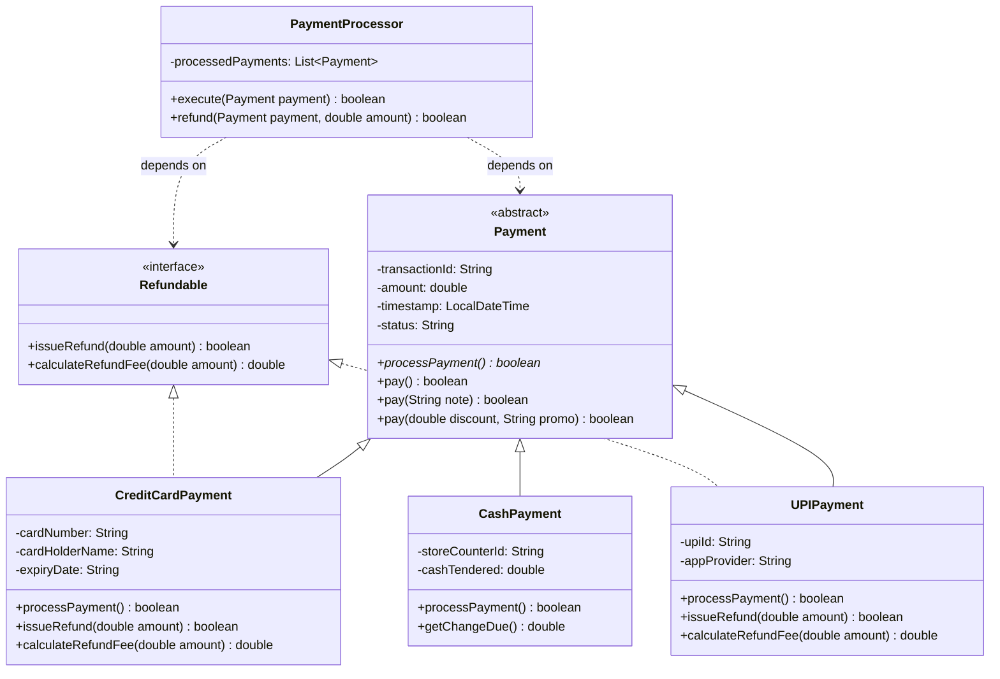

# Day 5: Inheritance, Polymorphism & Git Branching/Merging

## 📌 Task Overview
The objective of Day 5 is to develop a flexible **Payment Processing Hierarchy** in Java utilizing abstract classes, method overriding, method overloading, and interface contracts (`Refundable`). Additionally, this module incorporates a comprehensive **Git Branching, Merge Conflict Resolution, and Rebase Case Study**.

---

## 🏗️ Class Hierarchy & UML Architecture



---

## 🎯 Key Design Features
1. **Interface Segregation & Dependency Inversion**:
   - `PaymentProcessor` depends directly on `Payment` and `Refundable` abstractions rather than tightly coupling to concrete subclasses.
2. **Method Overloading**:
   - `pay()`: Default payment trigger.
   - `pay(String note)`: Attaches audit notes.
   - `pay(double discount, String code)`: Applies discount deductions dynamically.
3. **Polymorphic Method Dispatch**:
   - `processPayment()` is dynamically bound at runtime depending on the actual instance (`CreditCardPayment`, `UPIPayment`, or `CashPayment`).

---

## 🔀 Git Branching, Conflict Resolution & Rebase Walkthrough

### Scenario Simulation
Two developers collaborated on feature branches modifying payment fee calculations in `CreditCardPayment.java`.

### 1. Step 1: Creating Parallel Feature Branches
```bash
# Developer 1 creates branch 'feature/card-rewards'
git checkout -b feature/card-rewards
# Edits calculateRefundFee to 1.5% and commits
git commit -am "feat: update credit card refund fee to 1.5%"

# Developer 2 creates branch 'feature/gateway-fee-update' from earlier commit
git checkout main
git checkout -b feature/gateway-fee-update
# Edits same calculateRefundFee line to 2.5% and commits
git commit -am "feat: increase credit card refund processing fee to 2.5%"
```

### 2. Step 2: Merge Conflict on Main
```bash
# Developer 1 merges cleanly into main
git checkout main
git merge feature/card-rewards  # Fast-forward / Clean merge

# Developer 2 attempts to merge
git merge feature/gateway-fee-update
# CONFLICT (content): Merge conflict in CreditCardPayment.java
```

### 3. Step 3: Resolving Conflict Cleanly
Git marks the collision markers:
```text
<<<<<<< HEAD (main - 1.5%)
    return amount * 0.015;
=======
    return amount * 0.025;
>>>>>>> feature/gateway-fee-update (2.5%)
```
**Resolution Decision**: Agreed on standard tier fee of `2.0%` (0.02) with dynamic tiered logic:
```java
@Override
public double calculateRefundFee(double amount) {
    return amount * 0.02; // Resolved standard gateway fee
}
```

```bash
git add src/com/hcl/payment/model/CreditCardPayment.java
git commit -m "merge: resolve refund fee calculation conflict between feature branches"
```

### 4. Step 4: Clean Rebase Workflow
To maintain a linear Git history before final integration:
```bash
git checkout feature/gateway-fee-update
git rebase main
# All changes reapplied linearly on top of main
git checkout main
git merge --ff-only feature/gateway-fee-update
```

---

## 🚀 How to Compile & Run

```bash
# Compile
javac -d bin src/com/hcl/payment/model/*.java src/com/hcl/payment/service/*.java src/com/hcl/payment/app/*.java

# Run
java -cp bin com.hcl.payment.app.PaymentApplication
```

---

## 📊 Sample Execution Log

```text
===============================================================
  DAILY TASK 5: PAYMENT HIERARCHY & POLYMORPHISM ENGINE        
===============================================================

--- DEMONSTRATING OVERLOADED pay() METHODS ---

[Test 1: Standard pay()]
💳 Processing Credit Card payment via Payment Gateway...
   Card Holder: John Doe | Card: ****-****-****-4444 | Expiry: 12/28
   Charging: $2,500.00
✅ Authorization Approved! Authorization Code: AUTH-823912

[Test 2: Overloaded pay(note)]
📝 Transaction Note attached: "Monthly utility subscription fee"
📱 Processing UPI Payment via [Google Pay]...
   VPA / Virtual Address: john.doe@okhclbank | Amount: $850.00
✅ NPCI Instant Settlement Confirmed! RRN: UPI719283401928

[Test 3: Overloaded pay(discount, promo)]
🏷️  Promo Applied [FESTIVE15]: Saved $150.00 (15.0% off). New Total: $850.00
💳 Processing Credit Card payment via Payment Gateway...
   Card Holder: Sarah Connor | Card: ****-****-****-3333 | Expiry: 08/29
   Charging: $850.00
✅ Authorization Approved! Authorization Code: AUTH-384729


--- DEMONSTRATING POLYMORPHIC SERVICE DISPATCH ---

---------------------------------------------------------------
Initiating Payment Transaction: TXN-B2A91D04
---------------------------------------------------------------
💳 Processing Credit Card payment via Payment Gateway...
   Card Holder: John Doe | Card: ****-****-****-4444 | Expiry: 12/28
   Charging: $2,500.00
✅ Authorization Approved! Authorization Code: AUTH-901842

---------------------------------------------------------------
Initiating Payment Transaction: TXN-C71E4081
---------------------------------------------------------------
📱 Processing UPI Payment via [Google Pay]...
   VPA / Virtual Address: john.doe@okhclbank | Amount: $850.00
✅ NPCI Instant Settlement Confirmed! RRN: UPI183920194829

---------------------------------------------------------------
Initiating Payment Transaction: TXN-FA30182E
---------------------------------------------------------------
💵 Processing Over-the-Counter Cash Payment...
   Counter ID: COUNTER-POS-04 | Bill Amount: $320.00 | Cash Received: $350.00
   Change Returned to Customer: $30.00
✅ Cash Register Drawer Updated. Printed Receipt Generated.


--- DEMONSTRATING REFUNDABLE INTERFACE DISPATCH ---

---------------------------------------------------------------
Initiating Refund Request for: TXN-B2A91D04
---------------------------------------------------------------
🔄 Initiating Credit Card Refund...
   Refunding to Card: ****-****-****-4444 | Gross: $500.00 | Processing Fee (2%): $10.00 | Net Credited: $490.00
✅ Card Refund processed successfully back to issuing bank.

---------------------------------------------------------------
Initiating Refund Request for: TXN-C71E4081
---------------------------------------------------------------
🔄 Initiating Instant UPI Reversal / Refund...
   Crediting VPA: john.doe@okhclbank | Gross: $850.00 | Fee: $0.00 | Net Credited: $850.00
✅ Instant UPI credit completed to customer account.

---------------------------------------------------------------
Initiating Refund Request for: TXN-FA30182E
---------------------------------------------------------------
⚠️  Refund Not Supported: Payment type [CashPayment] does not implement the Refundable interface (e.g. Cash purchases must be settled manually at the counter).
```
